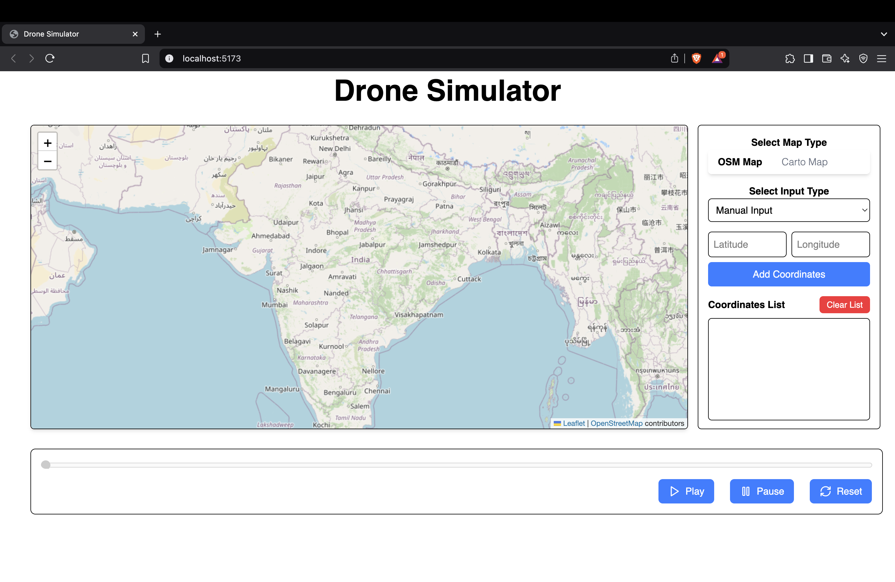
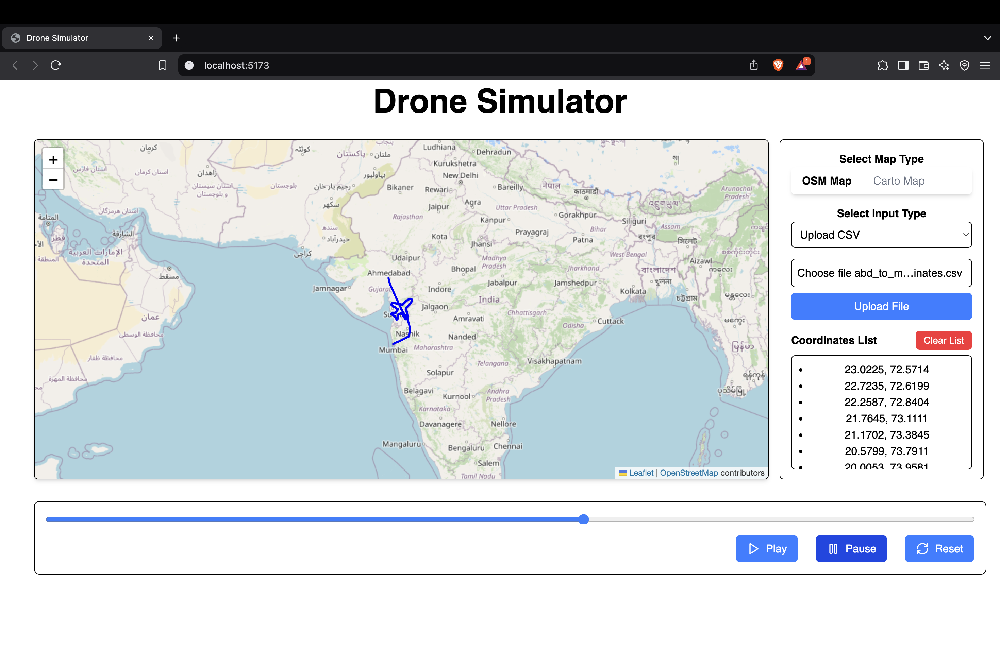

# Drone Simulator 🛩️

A real-time drone path simulation application built with React that allows users to visualize drone movements on an interactive map. The simulator supports both manual coordinate input and CSV file uploads for path definition.

## 📸 Screenshots




## Watch Demo

[Demo](https://youtu.be/eNDv73GMP3g?si=wg1mQKvSaYIN7rno)

## 🌟 Features

### Map Visualization
- Interactive map display using React-Leaflet
- Support for two map styles:
  - OpenStreetMap (OSM)
  - CARTO basemap
- Real-time drone position tracking
- Path visualization with polylines
- Animated drone marker
- Auto-centering on current drone position

### Path Control
- Play/Pause functionality
- Reset capability
- Progress bar for tracking simulation progress
- Manual progress control through slider

### Coordinate Input Methods
- Manual coordinate input
  - Latitude/Longitude validation
  - Real-time coordinate list display
- CSV file upload support
  - Automatic header detection for lat/lng columns
  - Data validation
  - Bulk coordinate processing

## 🚀 Getting Started

### Prerequisites
- Node.js (v14.0.0 or higher)
- npm or yarn

### Installation

1. Clone the repository
```bash
git clone https://github.com/HarshManiar1804/drone_simulator_assessment
```

2. Navigate to the project directory
```bash
cd drone_simulator_assessment
```

3. Install dependencies
```bash
npm install --legacy-peer-deps
# or
yarn install --legacy-peer-deps
```

4. Start the development server
```bash
npm run dev
# or
yarn dev
```

## 📦 Dependencies

- React
- React-Leaflet
- Leaflet
- Lucide React (for icons)

## 🎯 Usage

1. **Select Map Type**
   - Choose between OSM and CARTO map styles
   - Switch seamlessly between map providers

2. **Input Drone Coordinates**
   - Manual Input:
     - Enter latitude (-90 to 90) and longitude (-180 to 180)
     - Click "Add Coordinates" to add to path
   - CSV Upload:
     - Prepare CSV with latitude and longitude columns
     - Upload file and verify coordinates

3. **Control Simulation**
   - Use Play button to start simulation
   - Pause at any time to freeze drone position
   - Reset to return to starting position
   - Use progress slider for manual position control

## 📄 CSV File Format

The simulator accepts CSV files with the following format:
```csv
latitude,longitude
12.9716,77.5946
12.9717,77.5947
...
```
- Headers should contain "lat"/"latitude" and "lng"/"lon"/"longitude"
- Coordinates should be in decimal format
- Invalid coordinates will trigger error messages

## 🛠️ Technical Details

### Component Structure
- `App.jsx`: Main application component with lazy loading
- `Map.jsx`: Handles map rendering and drone animation
- `Controls.jsx`: Manages simulation controls
- `Sidebar.jsx`: Handles user input and coordinate management

### Performance Optimizations
- Lazy loading of components
- Debounced progress updates
- Memoized calculations for polylines
- Custom icon optimization


